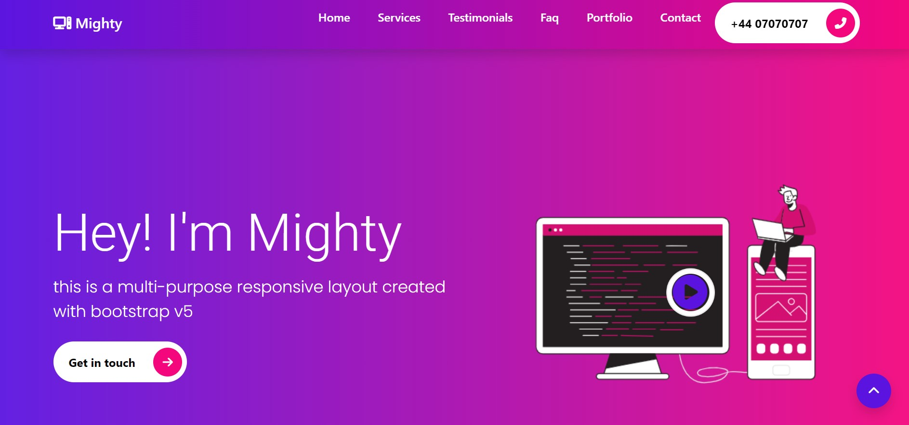

[Live Site](https://aneal07.github.io/Bootstrap-website/)

Bootstrap Website
This is a responsive website built using the Bootstrap framework. The website includes several sections such as Home, About, Services, Portfolio, Team, and Contact, each with its own unique content.

Features
Responsive design that adapts to different screen sizes and devices.
Navigation bar that allows easy access to different sections of the website.
Services section that showcases the different services offered by the website.
Portfolio section that displays images and descriptions of projects the website has worked on.
Team section that introduces the team members behind the website.
Contact form that allows visitors to send messages to the website's team.

Getting Started:
To run this website locally, simply clone the repository and open the index.html file in your web browser.
git clone https://github.com/aneal07/Bootstrap-website.git
cd Bootstrap-website
open index.html

Contributing:
If you would like to contribute to this project, please submit a pull request.

License
This project is licensed under the MIT License.

Acknowledgments
Thank you to the Bootstrap framework for providing pre-built components that made it easier to create this website.

